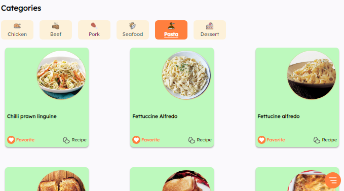
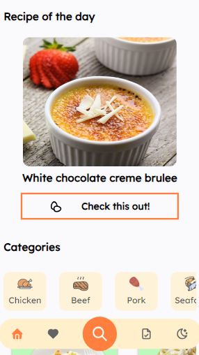

# Cuisine Craze

Have you ever found yourself in need of a new recipe but weren't sure where to start? Look no further! Our app is designed to make finding and discovering new recipes a breeze. Whether you’re searching for a quick weeknight dinner, a special holiday treat, or something new to spice up your meal routine, Cuisine Craze has you covered.

## Screenshots

## Features

- Light/dark mode toggle
- Search by food name
- Browse by Category
- Detailed Recipe Information

## Tech Stack

**Client:** HTML, CSS, JavaScript, React, TailwindCSS, Web Storage API

# Lessons Learned

Throughout the development of this app, I’ve gained some valuable insights into managing states (useState and useEffect) and using LocalStorage to enhance user experience.  

# The Challenges

One of the key challenges I encountered was organizing and managing the **file hierarchy and structure** in my project. As the project grew, keeping track of files and ensuring a logical structure became increasingly complex. It was sometimes tricky to determine the best way to organize components, utilities, and assets to maintain clarity and avoid confusion.

**Error handling** presented another significant challenge. Implementing error handling was crucial for ensuring that the app could handle a smooth experience even when errors where thrown without breaking the app. I faced difficulties in anticipating and catching various types of errors, especially on api responses.

# Keys for Improvement
For the file structure and hierarchy:

**Adopt a Consistent Structure**: Establish a clear and consistent file structure from the beginning. Anticipating early on what functions are necessary and assets are organized by feature or functionality. This makes it easier to navigate and maintain the project as it grows.

For the file error handling:

Using **try-catch blocks**, error handling mechanisms to catch and manage errors effectively also by returning a fallback like for example an array function would be used in the viewing of certain items, it's best to put a fallback if an api returns falsy values so that it would prevent breaking the app.

## Acknowledgements

These lists of documentation are what I'm currently using:

- [React](https://react.dev/)
- [MDN Web Docs](https://developer.mozilla.org/)
- [W3Schools](https://www.w3schools.com/)

For video tutorials:

- [@WebDevSimplified](https://www.youtube.com/c/webdevsimplified)